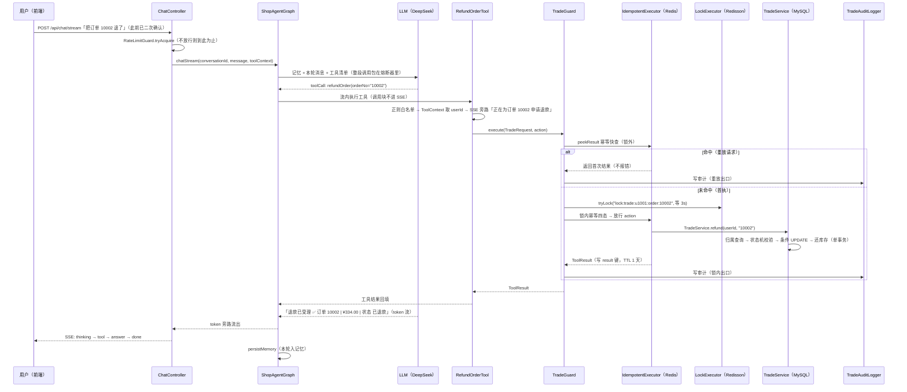

# ShopAgent 功能链路手册

> 定位：`business-logic.md` 是 W1/W2 时点的学习指南（交易部分当时还停留在「W3+ 展望」），本手册以**最终落地形态**为准，覆盖项目的四类功能链路，并对其中最核心的**退款链路**做端到端逐站详解。
> 所有类名、方法名均对应仓库当前真实代码；所有演示数字均引自 `docs/deploy/w8d5-demo-evidence.txt` 等证据文件，可复算。

## 1. 链路总览

九个工具、四类链路，全部挂在同一条对话主干上：

| 链路 | 触发场景 | 工具（tools/） | 业务层（service/） | 数据变化 |
|---|---|---|---|---|
| 查（订单/物流/商品/最近订单） | 「10001 到哪了」「我都买过什么」 | OrderQueryTool、LogisticsQueryTool、ProductSearchTool、ProductDetailTool、RecentOrdersTool | OrderService、LogisticsService、ProductService | 只读 |
| 问（RAG 知识问答） | 「露营灯防水吗」「充电宝能带上飞机吗」 | KnowledgeSearchTool | KnowledgeService | 只读（向量检索） |
| 办（下单） | 「帮我买两个移动电源」 | PlaceOrderTool | TradeService.place | 扣库存 → 新订单 PENDING_PAYMENT |
| 退 / 撤（退款、取消） | 「把它退了」「不要了取消吧」 | RefundOrderTool、CancelOrderTool | TradeService.refund / cancel | 状态迁移 + 还库存 + 审计 |

链路之外的**横切防线**（不属于某一条链路，属于每一轮对话）：

| 防线 | 位置 | 拦什么 |
|---|---|---|
| 限流 | `controller/ChatController`（入口第一闸） | 单用户刷请求（被限流直接短路，零记忆读、零 LLM 调用） |
| 熔断降级 | `agent/ShopAgentGraph` 的 chat 节点 | LLM 挂掉/超时 → `RuleFallbackService` 规则话术兜底，聊天主链路不死 |
| 交易闸序 | `infra/guard/TradeGuard`（工具层） | 模型重试、用户连点、SSE 断连重放导致的重复交易 |
| 审计 | `infra/audit/TradeAuditLogger` | 每次到达闸序的尝试各留一条物证 |

## 2. 每一轮对话共用的主干

无论哪条链路，一轮对话都先走这段（详细设计见 `business-logic.md` §2/§4，这里只列最终形态与代码位置）：

```
前端 index.html
  → POST /api/chat/stream {conversationId, message, userId}     controller/ChatController#chatStream
    → RateLimitGuard.tryAcquire(userId)                          不放行 → SSE error + done，本轮结束
    → 组装 toolContext：userId / conversationId / instructionDigest(指令sha256) / SSE事件回调
    → ShopAgentGraph.chatStream()                                agent/ShopAgentGraph
      → 图：START → loadMemory → chat → persistMemory → END
        loadMemory：chatMemory.get(conversationId)（Redis 存储，窗口 20 条）
        chat：LlmCircuitBreaker.execute 包住整段 LLM 调用
          → ChatClient.stream()（9 个工具 + System Prompt 三段式）
          → 模型输出 toolCall → Spring AI 在流内执行工具（调用块不进 SSE 流）
          → 工具结果回填 → 模型生成最终回答，token 经 sink 旁路流出
        persistMemory：本轮 user/assistant 消息写回记忆（降级轮也写）
    → SSE 事件合流：thinking → tool(旁路) → answer(×N) → done    Flux.merge + doFinally 关闭事件通道
```

两个理解成本最高的设计（spike 结论，详见 `ShopAgentGraph` 类注释）：

- **token 流不穿过图状态**：图在节点间会序列化克隆 state，Sinks / 带 lambda 的 toolContext 一进 state 就炸 `JsonMappingException`，所以响应式旁路对象走 invocation 持有表（UUID 键），state 只留可序列化值。
- **断连重放由交易闸收束**：客户端 SSE 断开只取消订阅，图在后台跑到 END、记忆照常落盘——用户重发同一句话，正是退款链路里幂等闸要拦的场景。

## 3. 详细链路：退款（简历核心「幂等 + 锁」的完整落点）

选退款做详解的理由：它是唯一一条把**二次确认、身份注入、幂等四态、分布式锁、状态机、库存回补、审计落库**全部串起来的链路，面试里被追问最深的每一层都能在这条链上指出对应代码。

### 3.1 链路一图流



### 3.2 逐站走读

**站 0 · 模型侧二次确认（Prompt 体验层）**
`config/ChatClientConfig` 的 SYSTEM_PROMPT「行为规范」：退款前必须先查订单核实，向用户复述「订单号、商品、金额、当前状态」，用户明确同意后才调用。这一层**可被诱导绕过**，所以它只是体验层——数据安全由后面的工具层兜底（与 W1D8 两层安全设计同构）。

**站 1 · 接入层装配（controller/ChatController#chatStream）**
限流 → 组装 toolContext。注意三个注入值：`userId`（模型不可见参数）、`conversationId`、`instructionDigest`（本轮用户消息原文的 sha256，`IdempotentKeys#instructionDigest`）——后两者是下单幂等键的组成部分，退款用不到，但注入口径统一在这一处。

**站 2 · 工具层入口（tools/trade/RefundOrderTool#refundOrder）**
依次做四件事：

1. **参数白名单**：`\d{1,20}` 正则，不过 → `ToolResult.badParam`。不信任模型传参，防幻觉参数打进 service 层。
2. **身份注入**：`ToolContextKeys.userId(toolContext)` 取 userId，缺失 → error。userId 不在 `@ToolParam` 签名里，模型**传不进来也伪造不了**。
3. **SSE 旁路事件**：`ToolEvents.publish(toolContext, "正在为订单 10002 申请退款")`，经 toolContext 里的 listener 直达前端。
4. **组装两把键，进闸**：
   - 幂等键 = `IdempotentKeys.orderAction("refund", userId, orderNo)` = sha256("refund|u1001|10002")。退款/取消已有订单号，键不含会话维度 → **跨会话也拦同一订单的重复退款**（对比下单键，见 §4.3）。
   - 锁键 = `LockKeys.order(userId, orderNo)` = `lock:trade:u1001:order:10002`，用户+订单粒度（ADR D4），可读不做 sha256（秒级生命周期，可读键便于 redis-cli 观测）。

**站 3 · 闸序编排（infra/guard/TradeGuard#execute）**
三个交易工具共用的编排（三处同构才抽的类，AGENTS.md「三处重复再抽」）：

```
result 快查（锁外）→ 抢锁(等 3s) → 锁内幂等四态执行 → finally 解锁
        │                                      │
        └── 每个出口各写一条审计 ←──────────────┘
```

快查放锁外的理由：重放请求直接返回首次结果，不付抢锁开销、不占临界区；快查与抢锁之间的空窗由锁内幂等二次检查兜底（双检）。

**站 4 · 幂等闸（infra/idempotent/IdempotentExecutor）**
Redis 两把键：`idempotent:mark:{key}`（已开始标志）与 `idempotent:result:{key}`（首次结果），TTL 均 86400s。**四态语义**：

| 态 | 条件 | 行为 | 为什么 |
|---|---|---|---|
| ① result 命中 | 首次结果已存 | **返回首次结果，不报错** | 模型见错会重试 → 死循环（ADR D3，项目核心决策） |
| ② mark 命中无 result | 在途，或前次执行崩溃 | reject「操作处理中」 | 宁可拒绝不可重复 |
| ③ 确定性结果 | 成功/参数错/查无/业务拒绝 | 结果照存 result 键 | 同键重放永远得到同结果 |
| ④ 瞬时错误 | code=50001 或异常 | **删 mark，放行下次重试** | mark 只为「已开始」负责，失败不该占住 24h |

Redis 本身故障 → fail-closed：删 mark 返「交易暂不可用」，**宁可不做交易不可失去保护**。锁外快查失败也返 null 走完整闸序，语义一致。

**站 5 · 锁闸（infra/lock/LockExecutor）**
`tryLock(3000ms)` 只传 waitTime 不传 leaseTime → **Redisson 看门狗续期**：业务执行再久锁不过期；进程崩溃后锁由默认 30s 过期回收（W8D5 的 redis-cli MONITOR 实录：`EVALSHA ... "lock:trade:u1001:order:..." "30000"`）。抢不到 → reject「操作处理中」，LLM 工具调用不做长排队。finally 里 `isHeldByCurrentThread` 防误删他人锁。与幂等的双保险关系：**锁防并发双写（mark SETNX 检查窗口），幂等防锁释放后的重放**——只锁不幂等会被重试穿透，只幂等不锁会在并发窗口内双写。

**站 6 · 业务层状态机（service/TradeService#refund → transition）**
单事务内四步：

1. **归属查询**：`orderNo + userId` 双条件同一条 SQL，他人订单与不存在返回同一种 notFound（不泄露存在性，防探测）。
2. **状态机校验**：退款仅 `SHIPPED/DELIVERED` 可办（`REFUNDABLE_FROM`）；不在白名单 → 按库内当前状态映射拒绝话术（工具层 `refundNotAllowedMsg`：REFUNDING→勿重复申请，PENDING_PAYMENT→引导取消…）。
3. **条件迁移**：`UPDATE ... SET status=REFUNDED WHERE orderNo=? AND userId=? AND status IN (SHIPPED, DELIVERED)`——`in(allowedFrom)` 让并发双改在 SQL 层就只成功一个，是**工具层锁之外的第二道防线**；影响行数=0 则回读最新状态给话术。
4. **还库存**：按 order_item 快照逐商品原子 `stock = stock + N`（不做读改写），退多少件还多少件。

**站 7 · 审计（infra/audit/TradeAuditLogger）**
写 `trade_audit_log`：userId / action / orderNo / 幂等键 / 结果码 / 结果话术（截断 255）。刻意**不在业务事务内**（调用点在 service 事务提交之后）：审计是物证不是闸门，写失败 warn 兜底人工补录，不阻断不回滚主交易。

**站 8 · 回填与收尾**
ToolResult 回填给模型 → 生成自然语言（token 流）→ SSE answer/done → persistMemory。工具层 catch-all 兜底：任何异常都转成 `ToolResult.error` 话术，**堆栈绝不抛给模型**。

### 3.3 三条实况分支（W8D5 真 DeepSeek 终验实录）

| 分支 | 实测表现 | 证据 |
|---|---|---|
| 首执成功 | 订单 10002 `DELIVERED → REFUNDED`，退款 ¥334.00，按明细还库存，审计 id=139（key=`5eb9d614…`， resultCode=0） | `docs/deploy/w8d5-demo-evidence.txt` |
| 同键重放（跨层经 `/api/dev/chaos/refund` 重放） | **同幂等键 2 条审计**（id=139/140，均 code=0）——重放出口也写审计是设计意图；返回首次结果，库存零变化 | 同上 + `docs/chaos/C3-refund-replay-x10.txt` |
| 状态机拒绝 | 模型先查订单看到 `REFUNDED`，不调工具、口头说明已退过——这是会话层的第三道防线（模型读到状态后自行收束）；工具层的话术拒绝（「请勿重复申请」）在 REFUNDING 等状态下生效 | 同上 |

### 3.4 故障与边界（哪些情况链路会「故意不办事」）

- **Redis 全挂**：锁和幂等同时 fail-closed，交易链路整体拒绝（C4 证据 `docs/chaos/C4-redis-down.txt`）——可用性让位于正确性，这是交易 vs 知识检索（fail-open）的分野。
- **LLM 熔断 OPEN**：请求根本到不了工具层，规则话术降级，交易零发生。
- **快查与抢锁的空窗**：两请求同时过了锁外快查 → 都进抢锁，串行进锁内幂等，第二个被 result 键拦住（双检的意义）。
- **已知局限①**：幂等 TTL 1 天，同句隔天复购会被误拦（记为已知局限，见 README）。
- **已知局限②（覆盖边界）**：W8D5 终验钓出的「模型口头退款」——HTTP 200 且答案像真的，但 `toolCalls={}`、审计零新增、库内状态未变。三层防线入口都在工具层，**没进闸的请求防不住**，靠审计表与库内真值双源互证才能识破；换会话重试即正常，证明链路本身正确。

### 3.5 链路追问预演

1. **为什么幂等返回首次结果而不是报错？** → LLM 把报错当失败会重试，重试又撞幂等 → 死循环（ADR D3）。
2. **锁超时任务没执行完怎么办？** → tryLock 不传 leaseTime，看门狗续期；极端情况下锁过期失守，还有 SQL 条件迁移（`status IN allowedFrom`）做第二道防线——锁是优化，正确性最后由数据库条件更新兜底。
3. **为什么退款幂等键不含会话、下单键却含？** → 下单时订单号不存在，必须靠「会话 + 指令摘要」区分「同句重发（重放）」与「换句复购（新意图）」；退款/取消已有订单号，`用户+动作+订单号` 天然唯一，跨会话拦重复才更安全。
4. **审计为什么不在事务里？** → 审计是物证不是闸门：主交易已提交，审计写失败不回滚不阻断（warn + 人工补录）；在事务里反而会让「记账失败」拖垮「交易成功」。

## 4. 其余链路简卡

### 4.1 查（订单 / 物流 / 商品 / 最近订单）

只读链路，走主干后由模型自主决策调用哪个（些）工具。两个值得讲的点：

- **并行调用**：模型可同时发起多个独立查询（W8D5 终验：单轮自主并行调 OrderQuery + Logistics），互不依赖的取数一轮拿全。
- **归属并入 SQL**：`OrderService/LogisticsService` 一律 `orderNo + userId` 双条件查询，「他人订单」与「不存在」同话术（W1D8 安全设计，退款链路的 transition 同口径）。

### 4.2 问（RAG 知识问答）

`KnowledgeSearchTool.searchKnowledge` → `KnowledgeService.search`，检索三段式（不引 reranker 模型，按规模分层的取舍）：

```
召回 top-5（RedisVectorStore.similaritySearch）
  → 相似度阈值 0.5 截断
  → 轻量规则重排取 top-3（标题整句命中 +0.30 / 字符 bigram 命中 +0.10）
  → 结构化注入给模型
```

- 零召回是**正常态**：返回 notFound 让模型如实告知，不注入垃圾上下文。
- **fail-open**：检索故障返回 error「知识库暂不可用」，聊天主链路照常——答错一句是体验问题，与交易的 fail-closed 相对。

### 4.3 办（下单）

与退款走同一套闸序，两处关键差异：

- **幂等键含会话维度**：`IdempotentKeys.placeOrder(userId, productId, qty, conversationId, instructionDigest)`——同句重发（同会话同指令摘要）= 重放拦截；换句话/换会话再买 = 新意图放行。会话或指令摘要缺失时 **fail-closed 拒绝执行**（无幂等保护的交易不做）。
- **防超卖在 SQL 层**：`TradeService.place` 用原子条件扣减 `UPDATE stock = stock - N WHERE id=? AND stock >= N`，影响行数=0 即库存不足——从 SQL 层杜绝「先查后改」的并发超卖窗口（W4 混沌 C2 的验证点）。锁键此时以商品维度代位（订单号尚不存在）。
- 实测：库存 43→42，新订单 PENDING_PAYMENT，审计 id=138（W8D5）。

### 4.4 撤（取消）

与退款同构（`transition(CANCELLED, {PENDING_PAYMENT})`），仅待付款可取消；已发货想取消 → 引导退款（状态机 + 话术双向引导）。同键重放实测全部 code=0（W8D5：商品 1 的 12 件单同键 12 行审计、商品 7 的 8 件单同键 8 行审计），库存按订单明细快照回补——12 件单取消后库存 42→43 只 +1、8 件单 100→101 只 +1，**回补的是下单时那一件商品的扣减量，不是请求数量**。

## 5. 证据指针

| 主题 | 文件 |
|---|---|
| 退款/下单/取消/幂等/锁 全链路终验 | `docs/deploy/w8d5-demo-evidence.txt` |
| 同键重放 x10 / Redis 宕机 / 降级矩阵 | `docs/chaos/C3-refund-replay-x10.txt`、`C4-redis-down.txt`、`C5-degradation-matrix-*.txt` |
| 缓存一致性冒烟 | `docs/cache/consistency-w5d3.txt` |
| MySQL 迁移冒烟 | `docs/deploy/w7d1-mysql-smoke.txt`、`w7d4-compose-smoke.md` |
| 设计定稿（幂等语义/锁粒度/闸序/RAG 参数） | `shopagent-w3w4-tasks.md` §2、`shopagent-w5-tasks.md` §2.3 |

## 相关文档

- `business-logic.md` — W1/W2 学习指南：五层架构与「为什么这样设计」（本文是其交易部分落地后的续篇）
- `README.md` — 面向评审者的门面：安全设计表、21 条踩坑实录、面试三层追问预演
- `shopagent-master-plan.md` — 8 周路线图与 ADR（唯一事实来源）
